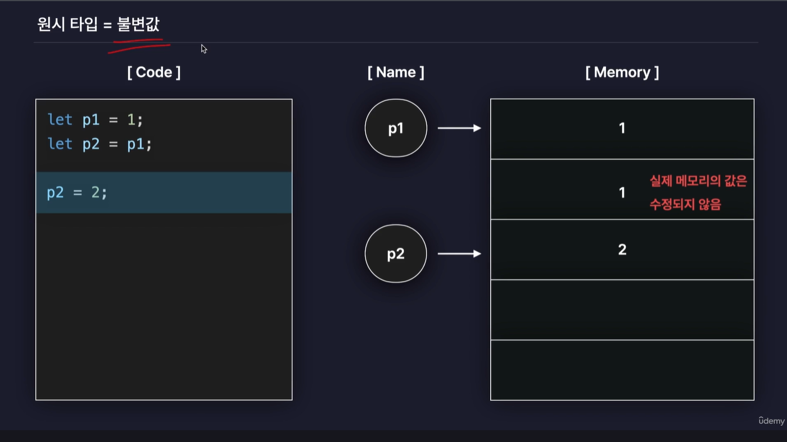
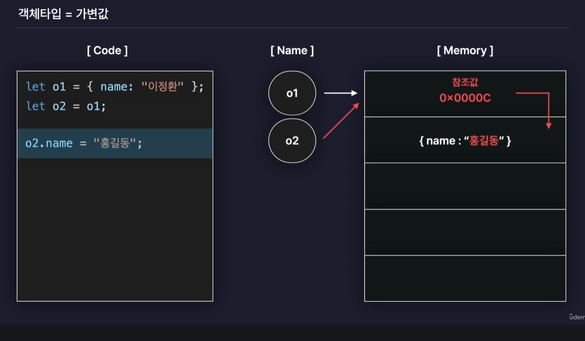
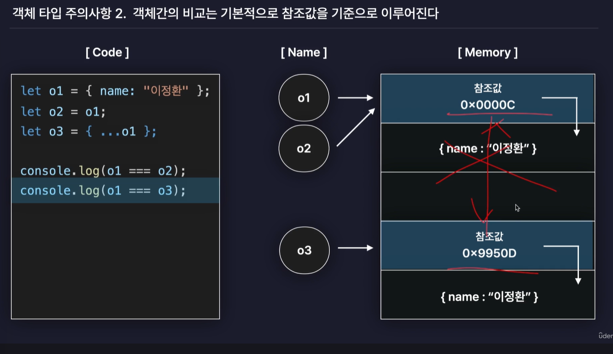
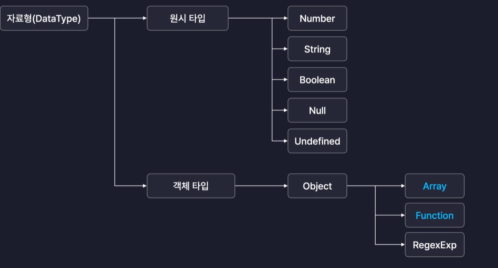

JavaScript심화

5강
원시타입 vs 객체 타입 차이점

- 자바스크립트가 모든 타입을  두가지로 나눈 이유는
원시와 객체 타입은 값이 저장되거나 복사되는방식이 서로 다르기 때문.
- 원시타입은 값 자체로써 변수에 저장되고 복사된다.(메모리값 수정X)
- 객체 타입은 참조값(값에 접근할 수 있는 주소)으로써 변수에 저장되고 복사된다. (메모리값 수정O)

1. 원시타입  = 불변값

2. 객체 타입 = 가변값

- 특정 프로퍼티 값을 수정하면 메모리에 저장된 원본 값이 수정됨

왜 그럴까?
원시타입과는 다르게 저장하는 값들이 동적으로 자주 바뀌기 때문에 

3. 객체 타입 주의사항
1) 의도치 않게 값이 수정될 수 있다
- 위 사진에서 o2의 값을 수정하면 의도치 않게 o1의 값도 수정됨 -> 얕은 복사
- 그래서 객체의 값을 복사할 때는 새로운 객체를 생성하고 그 내부에 스프레드 연산자를 이용해서 내부 프로퍼티만 따로 복사하는 방식으로 해야함. 
let o2 = {...o1} -> 깊은 복사

2) 객체간의 비교는 기본적으로 참조값을 기준으로 이루어진다. 
 
-> 얕은 비교

그래서 참조값이 아닌 프로퍼티 기준으로 두 객체를  비교하고 싶다면 JSON.stringify() 자바스크립트의 내장함수를 사용해 객체를 문자열로 변환하는 기능을 사용해야함. -> 깊은 비교

3) 배열과 함수도 사실 객체이다. 

그러므로 추가적인 프로퍼티와 매서드를 가질 수 있다.